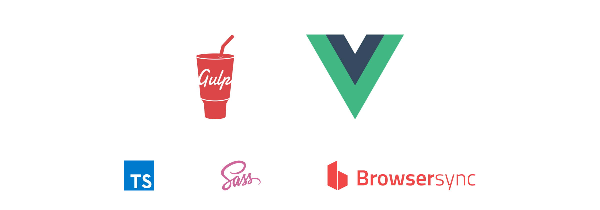

# vue-gulp-template

## Instalation

```js
vue init martin-badin/vue-gulp-template project-name
```

## Introduction

* the template using for watching files the [Browsersync](https://browsersync.io/)
* the template is set for [vuejs](https://vuejs.org) but it can be used for some other js frameworks
* the template is set for [sass](https://sass-lang.com/)
* add support for [typescript](https://www.typescriptlang.org/)
* include packages from node_modules in sass files

## Setup

### Update setting in [gulp.config.yml](https://github.com/martin-badin/vue-gulp-template/blob/master/gulp.config.yml)

* add path for output and update name if required
* update the proxy and add or remove path for watching files

```yaml
javascript:
  sources:
    - ./src/js/app.ts
  output:
    path: ./public/assets/js
    name: main.min.js
style:
  sources:
    - ./src/styles/style.scss
  output:
    path: ./public/assets/css
    name: style.min.css
browser_sync:
  proxy: localhost:8000
  browser: google chrome
  baseDir: ./
  files:
    - ./public/**/*
```